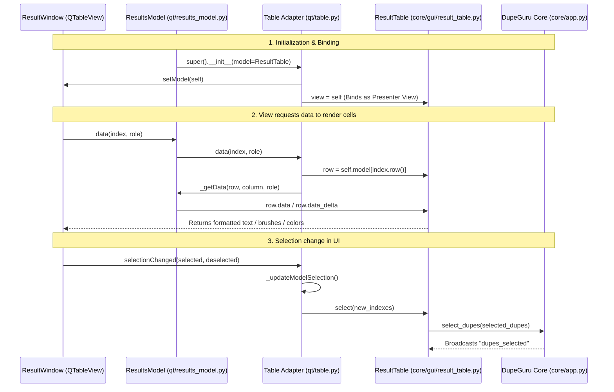

# dupeGuru Software Architecture & Design Patterns

This document describes the high-level architecture, software engineering patterns, and design decisions governing **dupeGuru**.

## 1. Architectural Philosophy: Model-View-Presenter (MVP) & Clean Architecture

dupeGuru is designed with a strict separation of concerns, decoupling its core business logic from the user interface toolkit (PyQt5). This decoupling follows **Clean Architecture** principles and is structured as a variation of the **Model-View-Presenter (MVP)** pattern.

The codebase is divided into three distinct layers:

```
┌────────────────────────────────────────────────────────┐
│                        VIEW LAYER                      │
│   (PyQt5 Widgets, Models & Dialogs in qt/)             │
└───────────────────────────┬────────────────────────────┘
                            │ (Calls presenters, implements protocols)
                            ▼
┌────────────────────────────────────────────────────────┐
│                    PRESENTER LAYER                     │
│   (Generic GUI logic in core/gui/ & hscommon/gui/)     │
└───────────────────────────┬────────────────────────────┘
                            │ (Binds to Core App Broadcaster)
                            ▼
┌────────────────────────────────────────────────────────┐
│                       CORE LAYER                       │
│   (Business Logic, Engine & Filesystem in core/)       │
└────────────────────────────────────────────────────────┘
```

1. **The Core Layer (`core/`)**: Responsible for file scanning, hashing, duplicate group building, ignore/exclude list management, and customization. It has **no dependency** on PyQt or any graphic toolkit.
2. **The Presenter Layer (`core/gui/` and `hscommon/gui/`)**: Manages UI state, selected rows, active columns, sorting descriptors, and dialog workflows. It represents visual components (like tables and trees) in pure Python.
3. **The View Layer (`qt/`)**: Implements concrete UI components using PyQt5. The View classes adapt the presenter objects to the Qt layout engine and translate Qt UI signals (clicks, selections) into presenter command calls.

---

## 2. The Double-Decoupling Mechanism

Decoupling the Core engine from the PyQt view is done through a dual-layered mechanism:

### Decoupling Level 1: App Model to Presenters (Pub-Sub)
The core application state ([core/app.py:DupeGuru](file:///Users/tinle/src/tinle/opensource/dupeguru/core/app.py#L81)) subclasses [hscommon.notify.Broadcaster](file:///Users/tinle/src/tinle/opensource/dupeguru/hscommon/notify.py#L19).

GUI presenter classes (such as [DirectoryTree](file:///Users/tinle/src/tinle/opensource/dupeguru/core/gui/directory_tree.py) and [ResultTable](file:///Users/tinle/src/tinle/opensource/dupeguru/core/gui/result_table.py)) subclass [hscommon.notify.Listener](file:///Users/tinle/src/tinle/opensource/dupeguru/hscommon/notify.py#L41).
- Presenters register themselves with the core application.
- When the core changes state (e.g., loading results or updating scanning folders), it invokes `self.notify("message_name")`.
- The listener automatically dispatches this message, executing a matching handler (e.g., `def directories_changed(self)`) in the presenter class.

### Decoupling Level 2: Presenters to Views (View Protocol & Injection)
Each presenter class inherits from [hscommon.gui.base.GUIObject](file:///Users/tinle/src/tinle/opensource/dupeguru/hscommon/gui/base.py#L17), which hosts a `.view` attribute.
- The presenter defines a "View Protocol" (expected methods that a UI view must support, e.g., `refresh()`, `show_message()`, or `select_dest_folder()`).
- On application bootstrap, the Qt View layer instantiates the presenters, sets itself as their `.view`, and implements the required view protocol methods.
- If the presenter's state changes, it calls `self.view.refresh()` or `self.view.show_message(msg)`. The presenter does not care *how* the toolkit displays the data, only that it implements the requested method.

---

## 3. Data Model Binding (The PyQt Bridge)

Qt uses its own MVC architecture (`QAbstractItemModel` paired with `QTableView`/`QTreeView`). dupeGuru bridges its generic presenters to Qt using adapter classes in `qt/`.

The sequence diagram below displays how the Results table loads data and stays synchronized with selections:



The adapter class [Table](file:///Users/tinle/src/tinle/opensource/dupeguru/qt/table.py#L21) acts as a subclass of `QAbstractTableModel`. It coordinates the Qt View's selection model and the core presenter's selected indexes:
- `_updateModelSelection()` reads selected rows in the `QTableView` selection model and pushes them to `self.model.select(new_indexes)`.
- `_updateViewSelection()` reads selection updates from the presenter model and updates the selection state on `QTableView`.

---

## 4. Dynamic Platform & Edition Dependency Injection

While business logic remains abstract, certain operations require toolkit-specific APIs (such as image decoding and metadata parsing). dupeGuru handles this via **dynamic class overriding**:

1. In `core/pe/photo.py`, a placeholder global is defined: `PLAT_SPECIFIC_PHOTO_CLASS = None`.
2. During application setup, the PyQt main class ([qt/app.py:DupeGuru](file:///Users/tinle/src/tinle/opensource/dupeguru/qt/app.py#L44)) overrides this variable with its own Qt implementation:
   ```python
   import core.pe.photo
   from qt.pe.photo import File as PlatSpecificPhoto
   core.pe.photo.PLAT_SPECIFIC_PHOTO_CLASS = PlatSpecificPhoto
   ```
3. The core engine is then free to instantiate `PLAT_SPECIFIC_PHOTO_CLASS` to leverage Qt-based image codecs (`QImageReader`, `QImage`) without directly importing any GUI libraries inside the `core` layer.

---

## 5. Headless Presenter Adaptation & MRO Safety

To support running in remote or headless environments without PyQt5 dependencies loaded (such as via the Web Console server), dupeGuru has been refactored to support **headless execution mode**:

1. **Diamond MRO Mismatches**: Python's Method Resolution Order (MRO) can trigger crashes if multiple inheritance trees attempt to resolve PyQt-reliant parent classes in a non-GUI execution thread. Presenters like `DupeGuruGUIObject` in [core/gui/base.py](file:///Users/tinle/src/tinle/opensource/dupeguru/core/gui/base.py) dynamically delegate view attributes.
2. **Fallback to NoopGUI**: When running headlessly, the view object is injected as an instance of `NoopGUI` (or `WebViewAdapter`). Any GUI protocol method invoked by core presenters (e.g. `self.view.refresh()`) is intercepted and bypassed cleanly rather than throwing `AttributeError`.

---

## 6. HTML Web UI & REST Server Architecture

The Web Console introduces a lightweight, robust client-server architecture built on top of the generic `Presenter` layer:

```
┌──────────────────────────────────────────────┐
│                  HTML Web UI                 │
│      (HTML, Vanilla CSS, JS in web/static/)  │
└──────────────────────┬───────────────────────┘
                       │ (Ajax / Fetch API with cache busters)
                       ▼
┌──────────────────────────────────────────────┐
│               HTTP REST Server               │
│       (Python Web Server in web/server.py)   │
└──────────────────────┬───────────────────────┘
                       │ (WebViewAdapter and pulse_loop)
                       ▼
┌──────────────────────────────────────────────┐
│             Generic Presenters               │
│         (core/app.py & core/gui/)            │
└──────────────────────────────────────────────┘
```

### Component Structure
1. **REST API Handler (`web/server.py`)**: Runs a standard library HTTP server that handles API routes (`GET /api/status`, `POST /api/scan`, `GET/POST /api/config`, `POST /api/directories`).
   - **Paginated Results endpoint (`GET /api/results`)**: Supports `limit` and `offset` query parameters to fetch results in slices, reducing network payload and browser rendering memory. Returns global `total_marked` counts for deletion synchronizations.
2. **WebViewAdapter**: Implements the Core View Protocol, translating core notifications (e.g., scan progress, file list changes) into structured JSON updates written to a global `app_state` dictionary.
3. **Background Pulse Loop**: A background thread continuously runs `model.progress_window.pulse()` during scans, updating the active thread states and resetting the job runner cleanly to `idle` upon completion or cancellation.
4. **Cache-Buster Strategy**: Both HTTP header controls (`Cache-Control: no-store`) and client-side epoch queries (`?_t=timestamp`) are implemented to prevent web browsers from caching dynamic status or target directory updates.
5. **Static Web UI Client (`web/static/`)**: A responsive UI using Vanilla CSS and JavaScript. It queries the REST API, lists scannable directories with real-time `✓ Added` badges, renders progress bars, displays glassmorphic toast alerts, and provides pagination controls (`Next`/`Previous` page navigation) for results.
