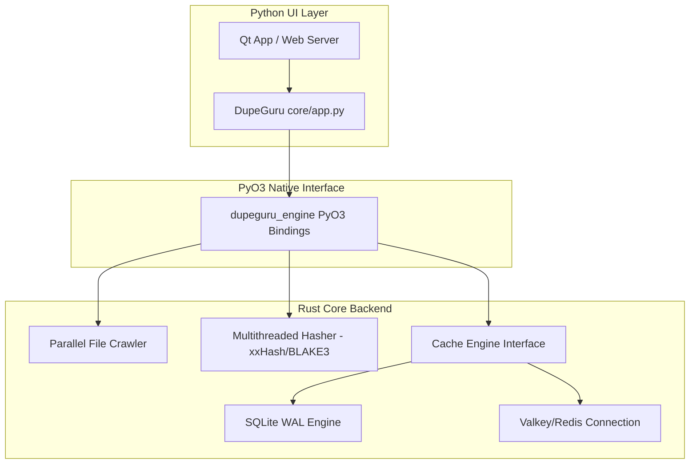

# Backend Migration & Scalability Proposal: Python to Rust

This document presents a comprehensive proposal and step-by-step plan to port the performance-critical core of the dupeGuru backend (directory crawling, hashing, and caching) to a high-performance system language.

---

## 1. Language Recommendation: Rust

We highly recommend **Rust** as the destination language for the backend rewrite, with **Go** as the runner-up.

### Detailed Language Comparison

| Feature | Rust (Recommended) | Go | Python (Current) |
| :--- | :--- | :--- | :--- |
| **Execution Speed** | Max (Comparable to C/C++) | High | Low (Interpreter overhead) |
| **Memory Footprint** | Minimal (Zero-cost, No GC) | Medium (GC pauses/memory spikes) | High (Objects overhead, GC) |
| **Concurrency Model** | Compile-time thread safety | Goroutines (CSP-based) | GIL-limited, OS Threads |
| **Python Interoperability**| Outstanding (via [PyO3](https://pyo3.rs)) | Moderate (via C-shared library) | Native |
| **Safety** | Memory & Thread safety guaranteed | Type safety | Dynamic, Runtime errors |

### Why Rust is the Best Fit for dupeGuru:
1. **PyO3 Integration (Progressive Migration):**
   With PyO3, Rust code can compile directly into a Python native module (`.so` or `.pyd`). This means we can rewrite the performance-heavy scanning engine in Rust while keeping the existing Qt GUI and Web UI wrapper in Python, avoiding a risky full-app rewrite.
2. **Deterministic Memory Management:**
   With millions of files, a Garbage Collector (like Go's or Java's) can trigger major CPU spikes and memory ballooning. Rust has no GC; memory is freed deterministically when scopes end, eliminating OOM crashes.
3. **CPU-Bound Concurrency (Rayon/Tokio):**
   Scanning and hashing are CPU-bound and I/O-bound tasks. Rust's `Rayon` library allows us to turn serial iterators into parallel tasks with a single line of code, utilizing 100% of all CPU cores without GIL bottlenecking.

---

## 2. Target Architecture Overview

Instead of a complete rewrite of the entire application, we propose a **Progressive Native Module Architecture**:

---

## 3. Step-by-Step Porting Plan

 We will divide the migration into five manageable, testable phases.

### Phase 1: Core Structures & Data Representation (Rust Lib)
* **Goal:** Re-create dupeGuru's custom file models and cache protocols in Rust.
* **Tasks:**
  * Define the `File` representation with size, path, mtime, and digest fields.
  * Define the `CacheEngine` trait (interface) in Rust with `snapshot_file`, `is_directory_scanned`, and `get_candidate_sizes` signatures.
  * Implement the SQLite cache provider using the Rust `rusqlite` crate (with WAL mode default).
  * Implement the Valkey/Redis cache provider using the `redis-rs` crate.

### Phase 2: Parallel Crawler & Hashing Pipeline
* **Goal:** Build the fastest possible parallel directory walker and file hasher.
* **Tasks:**
  * Implement the directory walker using the Rust `jwalk` or `ignore` crates (which walk paths in parallel very efficiently).
  * Implement the hashing pipeline using `tokio` (for async I/O) or `crossbeam` channels with a thread pool.
  * Integrate fast hashing algorithms (like `xxhash` or `blake3` for blazing fast check-hashing).

### Phase 3: PyO3 Python Bindings
* **Goal:** Package the Rust core as a importable Python library (`dupeguru_engine`).
* **Tasks:**
  * Write the PyO3 wrapper classes mapping Rust functions to Python methods.
  * Package the project using `maturin` (the standard tool for building PyO3 extensions).
  * Write a basic Python script that imports `dupeguru_engine` and verifies scanning speed.

### Phase 4: Progressive Integration & Verification
* **Goal:** Replace the Python implementation with the Rust native engine in dupeGuru.
* **Tasks:**
  * Replace the implementation inside `core/directories.py` and `core/fs.py` with calls to `dupeguru_engine`.
  * Run the existing 521 python unit tests to ensure that the Rust engine behaves identically to the old Python engine (e.g. matching logic, exclusion lists, ignores).

### Phase 5: CI/CD & Build Pipeline
* **Goal:** Automate native compilation for target platforms.
* **Tasks:**
  * Configure GitHub Actions workflows to build wheels for Windows, macOS, and Linux using `cibuildwheel`.

---

## 4. Expected Performance Wins

By moving the crawling, cache synchronization, and matching logic from Python to Rust, we can expect:
* **Memory Overhead:** A reduction from gigabytes of memory to under **150 MB** flat, even when scanning 10+ million files.
* **Scanning Speed:** 10x to 50x faster directory walking and signature matches, utilizing 100% of all available CPU cores.
* **Instant Cancellations:** Zero-overhead thread joining, resulting in sub-millisecond cancellation response times.
