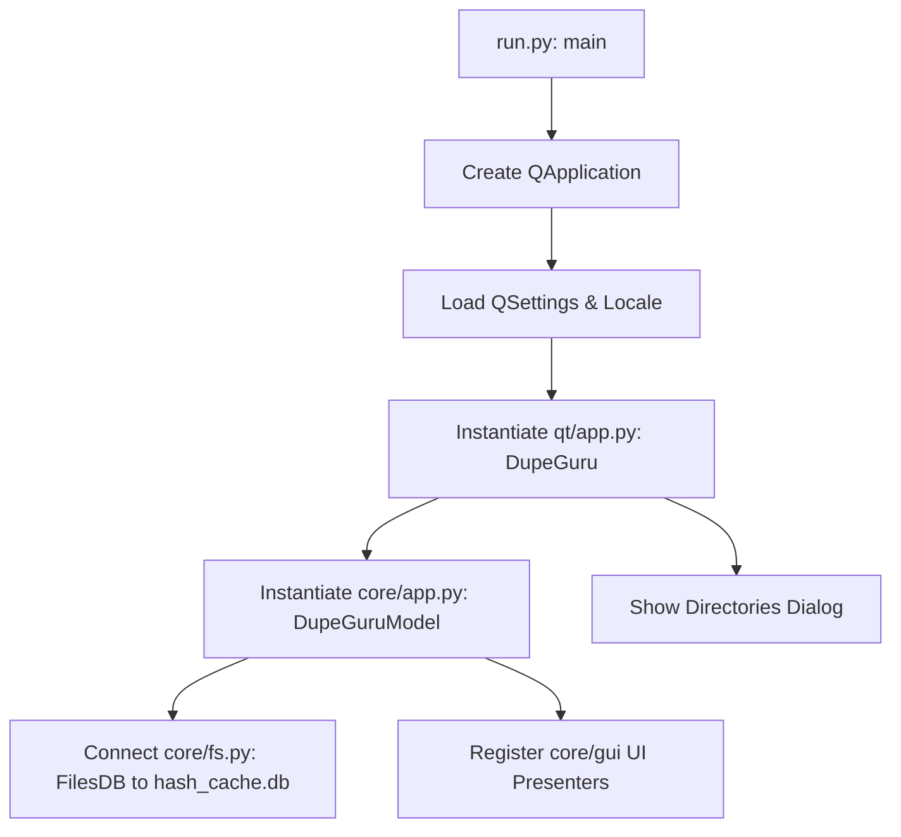
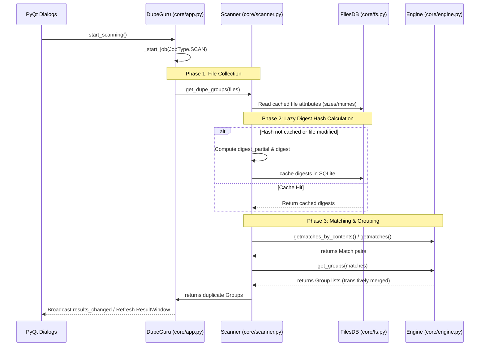

# dupeGuru Runtime Data Flow Analysis

This document traces the data pipelines, control flow, and lifecycles of **dupeGuru** from startup to file deletion.

---

## 1. Application Bootstrap & Initialization

When dupeGuru starts, control flows from the command line wrapper into the PyQt user interface and then sets up the core engine.

1. **Bootstrap (`run.py`)**:
   - Instantiates `QApplication`.
   - Sets organization properties and loads local settings using [create_qsettings()](file:///Users/tinle/src/tinle/opensource/dupeguru/run.py#L55).
   - Installs localized text maps using [install_gettext_trans_under_qt()](file:///Users/tinle/src/tinle/opensource/dupeguru/run.py#L58).
   - Instantiates the main Qt application class [qt/app.py:DupeGuru](file:///Users/tinle/src/tinle/opensource/dupeguru/qt/app.py#L44).
2. **Core Binding**:
   - `qt/app.py:DupeGuru` instantiates [core/app.py:DupeGuru](file:///Users/tinle/src/tinle/opensource/dupeguru/core/app.py#L81) (known as the `model`).
   - The core application initializes the file cache SQLite connection: `fs.filesdb.connect(hash_cache_file)`.
   - The core registers UI presenter listeners (e.g. `DirectoryTree`, `StatsLabel`, `DetailsPanel`).
   - PyQt creates the layout, mapping presenters to views (e.g., [DirectoriesDialog](file:///Users/tinle/src/tinle/opensource/dupeguru/qt/directories_dialog.py) and [ResultWindow](file:///Users/tinle/src/tinle/opensource/dupeguru/qt/result_window.py)).

---

## 2. Directory Selection & Filter Pipeline

Before scanning, the user adds target folders and configures their directory states:

1. **Path Addition**:
   - Dragging a folder into the UI triggers `self.app.model.add_directory(path)`.
   - The path is validated and appended to [core/directories.py:Directories](file:///Users/tinle/src/tinle/opensource/dupeguru/core/directories.py#L47).
2. **Default State Evaluation**:
   - For each added path, the system assigns a default [DirectoryState](file:///Users/tinle/src/tinle/opensource/dupeguru/core/directories.py#L26):
     - If the path matches any regular expression in the [ExcludeList](file:///Users/tinle/src/tinle/opensource/dupeguru/core/exclude.py#L62) (e.g. `.git/`, `$Recycle.Bin`, `.DS_Store`), its state is set to `EXCLUDED`.
     - Otherwise, its state is set to `NORMAL`.
   - The user can manually toggle a folder's state to `REFERENCE` (meaning files in this folder are scannable but cannot be deleted) or `EXCLUDED` (skipped entirely).
3. **Change Notification**:
   - The core broadcasts a `directories_changed` message.
   - Presenter updates its tree state and refreshes the [DirectoriesModel](file:///Users/tinle/src/tinle/opensource/dupeguru/qt/directories_model.py) in PyQt to re-render the paths.

---

## 3. The Scanning & Comparison Pipeline

When the user clicks **Scan**, dupeGuru initiates a multi-stage background job.

### Phase 1: Collection & Lazy Loading
- [Directories.get_files()](file:///Users/tinle/src/tinle/opensource/dupeguru/core/directories.py#L125) recursively crawls the filesystem under the target directories.
- It skips `EXCLUDED` subfolders.
- Files are collected as lazy-loading instances of [File](file:///Users/tinle/src/tinle/opensource/dupeguru/core/fs.py#L202) (or `MusicFile`/`Photo` depending on the active edition). No file content is read at this stage.

### Phase 2: SQLite Metadata Cache Hook
- The scanner iterates over files to check sizes and modification times.
- If a property like `digest` or `digest_partial` is accessed, Python's `__getattribute__` triggers `_read_info()`.
- `_read_info()` queries [FilesDB](file:///Users/tinle/src/tinle/opensource/dupeguru/core/fs.py#L100) using the file's path, size, and modification time (`st_mtime_ns`):
  - **Cache Hit**: Returns the cached digest. No disk read is performed.
  - **Cache Miss**: Reads the file and calculates the digest. The new digest is written back to `hash_cache.db`.
- **Digests used**:
  - `digest_partial`: Hashed value of the first 16KB of the file at a 16KB offset.
  - `digest`: Full file hash (used for smaller files).
  - `digest_samples`: Sampled hashes taken at 25%, 60%, and the end of the file (used to speed up comparison of large files).

### Phase 3: Comparison & Matching
The engine uses specific algorithms depending on the scan type:
1. **Filename Scan**: Normalizes names, splits them into word blocks, and uses Python's `difflib` to match similar names.
2. **Content Scan**: Grouped by file size. Candidates are matched by comparing `digest_partial` first. If matching, full `digest` (or `digest_samples` for large files) is compared.
3. **Fuzzy Photo Scan**:
   - Loads the image via Qt codecs and handles orientation rotation.
   - Computes average colors for a 15x15 block grid.
   - Compares block difference averages using C-extension routines ([avgdiff()](file:///Users/tinle/src/tinle/opensource/dupeguru/core/pe/block.py#L84)).
   - Evaluates combinations in parallel using `multiprocessing`.

### Phase 4: Transitive Grouping & Prioritization
- All matched pairs `Match(first, second, percentage)` are compiled.
- [engine.get_groups()](file:///Users/tinle/src/tinle/opensource/dupeguru/core/engine.py#L452) builds transitive groups: if File A matches File B, and File B matches File C, they are merged into a single `Group`.
- [Group.prioritize()](file:///Users/tinle/src/tinle/opensource/dupeguru/core/engine.py#L426) orders the duplicate list inside the group using user-defined criteria. The top-ranked file is set as the `Group.ref` (Reference File) and is protected from deletion, while the remaining files (`Group.dupes`) are marked.

---

## 4. Action Execution (Deletion, Renaming, & Moving)

When the user interacts with the duplicates (e.g. deleting them):

1. **Delete Request**:
   - The user selects "Send Marked to Trash".
   - `qt/app.py` triggers `delete_marked()`.
2. **Options Presentation**:
   - [DeletionOptions](file:///Users/tinle/src/tinle/opensource/dupeguru/core/gui/deletion_options.py) gathers flags:
     - `direct`: Delete files immediately (bypass trash).
     - `link_deleted`: Replace deleted files with symlinks or hardlinks.
     - `use_hardlinks`: Use hard links instead of symbolic links.
3. **Async File Execution**:
   - Starts `JobType.DELETE` running `_do_delete()`.
   - For each marked duplicate, the engine:
     - Deletes the file via `send2trash` or `os.remove()`.
     - If `link_deleted` is active, it creates a link pointing from the deleted path to the reference file (`os.link` or `os.symlink`).
   - If an error occurs, it is logged and appended to `self.problem_dialog` for user notification.
   - Once complete, results are refreshed, and the UI updates to show the remaining files.
