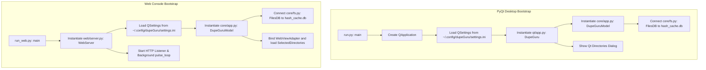
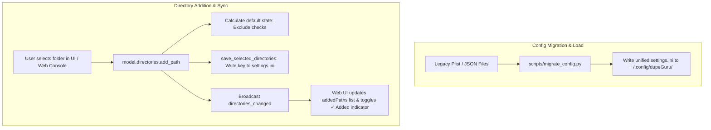
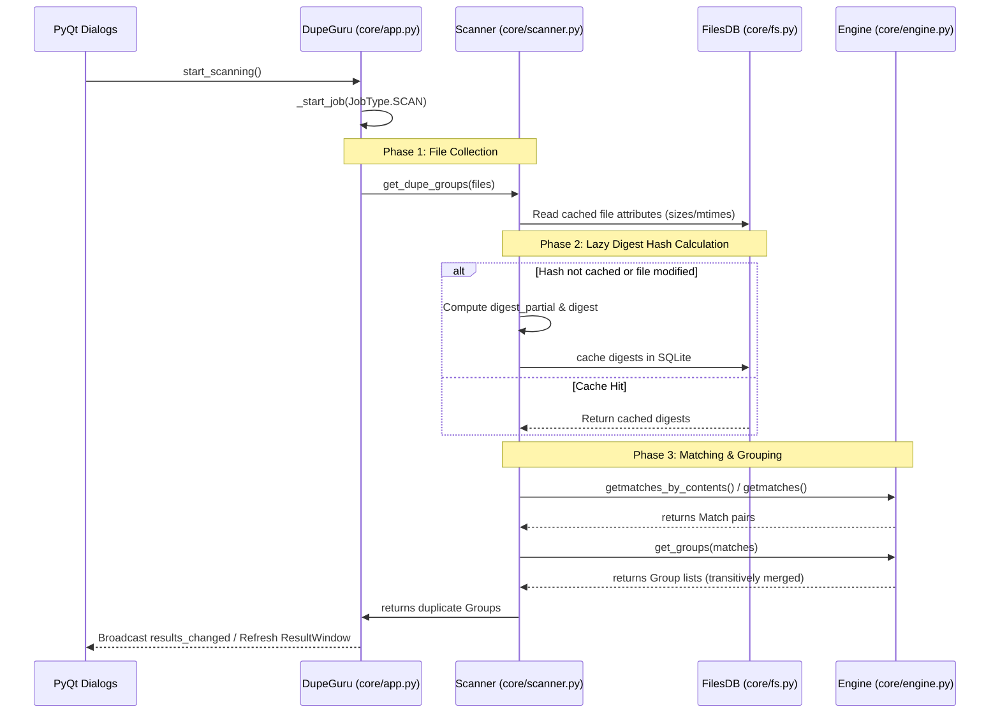
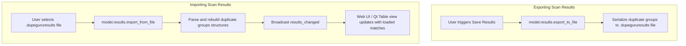

# dupeGuru Runtime Data Flow Analysis

This document traces the data pipelines, control flow, and lifecycles of **dupeGuru** from startup to file deletion.

---

## 1. Application Bootstrap & Initialization

dupeGuru supports two independent boot paths depending on the desired interface mode:

### 1.1 PyQt Desktop Bootstrap (`run.py`)
1. **Application Init**: Instantiates a PyQt `QApplication`, registers organization settings, and installs translation maps.
2. **Presenter Connection**: Instantiates the core model class [core/app.py:DupeGuru](file:///Users/tinle/src/tinle/opensource/dupeguru/core/app.py#L81) which boots the SQLite filesystem database (`hash_cache.db`).
3. **Presenter-View Mapping**: Instantiates and binds GUI presenter listeners (e.g. `DirectoryTree`, `ResultTable`) to concrete Qt views.

### 1.2 Web Console Bootstrap (`run_web.py` & `web/server.py`)
1. **Server Setup**: Starts an HTTP server listening on the configured port.
2. **Decoupled View Injection**: Instantiates the core model. Because we are headlessly booting:
   - Presenter classes fall back to the Diamond-MRO safe `NoopGUI` interface to avoid PyQt errors in worker threads.
   - The `/api` router registers a custom `WebViewAdapter` to capture model notifications.
3. **Configuration & Restore**: Reads the standard macOS/Unix config file (`~/.config/dupeGuru/settings.ini`), restores any directories previously saved in `SelectedDirectories`, and starts the async progress `pulse_loop` daemon thread.

---

## 2. Directory Selection & Filter Pipeline

Before scanning, the user adds target folders and configures their directory states:

### 2.1 Configuration Migration & Standard Path
To achieve multi-platform consistency and dry configuration principles:
1. On Unix/macOS operating systems, dupeGuru stores preferences inside `~/.config/dupeGuru/settings.ini`.
2. A startup script `migrate_config.py` merges native Apple plist defaults and old web settings JSON configurations into the new INI path, deleting legacy backups upon completion.

### 2.2 Path Addition & Validation
1. **Model Registration**: Adding a path (via UI drag-and-drop or Web Console selection) calls `model.directories.add_path(path)`:
   - Validates existence (raises `InvalidPathError` if path doesn't exist).
   - Prevents nested duplication (raises `AlreadyThereError` if path is already included or has a parent in the list).
2. **Default State Evaluation**:
   - For each added path, the system assigns a default [DirectoryState](file:///Users/tinle/src/tinle/opensource/dupeguru/core/directories.py#L26):
     - If the path matches any regular expression in the [ExcludeList](file:///Users/tinle/src/tinle/opensource/dupeguru/core/exclude.py#L62) (e.g. `.git/`, `$Recycle.Bin`, `.DS_Store`), its state is set to `EXCLUDED`.
     - Otherwise, its state is set to `NORMAL`.
   - The user can manually toggle a folder's state to `REFERENCE` (scannable but protected from deletion) or `EXCLUDED` (skipped).

### 2.3 Selected Directories Persistence & UI Toggle
1. **Settings Sync**: When paths are added or removed, `save_selected_directories()` serializes the active list of strings to `SelectedDirectories` inside `QSettings` and writes it to disk.
2. **Change Broadcast**: The core broadcasts a `directories_changed` message.
3. **Web UI Indicators**: The Web client receives the update, recalculates its active target directories flow, and immediately updates the folder browser to render a green `✓ Added` status badge, disabling further duplicate addition actions for that directory.

---

## 3. The Scanning & Comparison Pipeline

When the user clicks **Scan**, dupeGuru initiates a multi-stage background job.

### Phase 1: Streamed Collection & Lazy Loading
- [Directories.get_files()](file:///Users/tinle/src/tinle/opensource/dupeguru/core/directories.py#L125) recursively crawls the filesystem under the target directories.
- It skips `EXCLUDED` subfolders.
- **Memory Optimization:** During Content scans with caching enabled, the directory crawler runs as a generator directly populating the cache DB in $O(1)$ memory instead of eagerly loading all discovered file objects into a Python list.

### Phase 2: SQLite Metadata Cache & Batching
- The scanner iterates over files to check sizes and modification times.
- If a property like `digest` or `digest_partial` is accessed, Python's `__getattribute__` triggers `_read_info()`.
- `_read_info()` queries [FilesDB](file:///Users/tinle/src/tinle/opensource/dupeguru/core/fs.py#L100) using the file's path, size, and modification time (`st_mtime_ns`):
  - **Cache Hit**: Returns the cached digest. No disk read is performed.
  - **Cache Miss**: Reads the file and calculates the digest. The new digest is written back to `hash_cache.db`.
- **Candidate Size Index & Batching:**
  - Files are processed in size-based batches of `2000` size groups.
  - SQLite uses index `idx_files_size` on the `size` column of the `files` table to instantly lookup size groups and fetch batch files without scanning the entire database.
  - `gc.collect()` is run after each size batch to immediately free RAM.
- **Digests used**:
  - `digest_partial`: Hashed value of the first 16KB of the file at a 16KB offset.
  - `digest`: Full file hash (used for smaller files).
  - `digest_samples`: Sampled hashes taken at 25%, 60%, and the end of the file (used to speed up comparison of large files).

### Phase 3: Comparison & Matching
The engine uses specific algorithms depending on the scan type:
1. **Filename Scan**: Normalizes names, splits them into word blocks, and uses Python's `difflib` to match similar names.
2. **Content Scan**: Grouped by file size. Candidates are matched by comparing `digest_partial` first. If matching, full `digest` (or `digest_samples` for large files) is compared.
   - **Pivot Grouping:** Uses linear pivot comparisons ($M-1$ comparisons) rather than $O(N^2)$ combinations.
   - **Bypass Candidate Checks:** For exact content matches (`percentage == 100`), the engine bypasses `defaultdict(set)` candidate mapping entirely.
3. **Fuzzy Photo Scan**:
   - Loads the image via Qt codecs and handles orientation rotation.
   - Computes average colors for a 15x15 block grid.
   - Compares block difference averages using C-extension routines ([avgdiff()](file:///Users/tinle/src/tinle/opensource/dupeguru/core/pe/block.py#L84)).
   - Evaluates combinations in parallel using `multiprocessing`.

### Phase 4: Transitive Grouping & Prioritization
- All matched pairs `Match(first, second, percentage)` are compiled.
- [engine.get_groups()](file:///Users/tinle/src/tinle/opensource/dupeguru/core/engine.py#L452) builds transitive groups: if File A matches File B, and File B matches File C, they are merged into a single `Group`.
- **Match Pruning:** For exact scans, all duplicate-to-duplicate matches that do not involve the reference file `Group.ref` are pruned, reducing matches memory from $O(N^2)$ to $O(N)$.
- [Group.prioritize()](file:///Users/tinle/src/tinle/opensource/dupeguru/core/engine.py#L426) orders the duplicate list inside the group using user-defined criteria. The top-ranked file is set as the `Group.ref` (Reference File) and is protected from deletion, while the remaining files (`Group.dupes`) are marked.

---

## 4. Action Execution (Deletion, Renaming, & Moving)

When the user interacts with the duplicates (e.g. deleting them):

1. **Delete Request**:
   - The user selects "Send Marked to Trash".
   - `qt/app.py` triggers `delete_marked()`.
2. **Options Presentation**:
   - [DeletionOptions](file:///Users/tinle/src/tinle/opensource/dupeguru/core/gui/deletion_options.py) gathers flags:
     - `direct`: Delete files immediately (bypass trash).
     - `link_deleted`: Replace deleted files with symlinks or hardlinks.
     - `use_hardlinks`: Use hard links instead of symbolic links.
3. **Async File Execution**:
   - Starts `JobType.DELETE` running `_do_delete()`.
   - For each marked duplicate, the engine:
     - Deletes the file via `send2trash` or `os.remove()`.
     - If `link_deleted` is active, it creates a link pointing from the deleted path to the reference file (`os.link` or `os.symlink`).
   - If an error occurs, it is logged and appended to `self.problem_dialog` for user notification.
   - Once complete, results are refreshed, and the UI updates to show the remaining files.

---

## 5. Results Serialization Flow (Save & Load Scans)

Both the PyQt UI and the Web Console support saving scan results to disk and reloading them later:

1. **Exporting (Save)**:
   - Invoking "Save Results" calls `model.results.export_to_file(destination_path)`.
   - The engine serializes the matching scan configuration (active options, filter criteria) and the lists of duplicate groups into a `.dupegururesults` file.
2. **Importing (Load)**:
   - Invoking "Load Scan" calls `model.results.import_from_file(source_path)`.
   - The engine validates and parses the scan results file, repopulates `model.results.groups`, and broadcasts `results_changed`.
   - The View layer (either Qt `ResultWindow` or Web UI) picks up the broadcast and immediately renders the loaded scan duplicate table.
