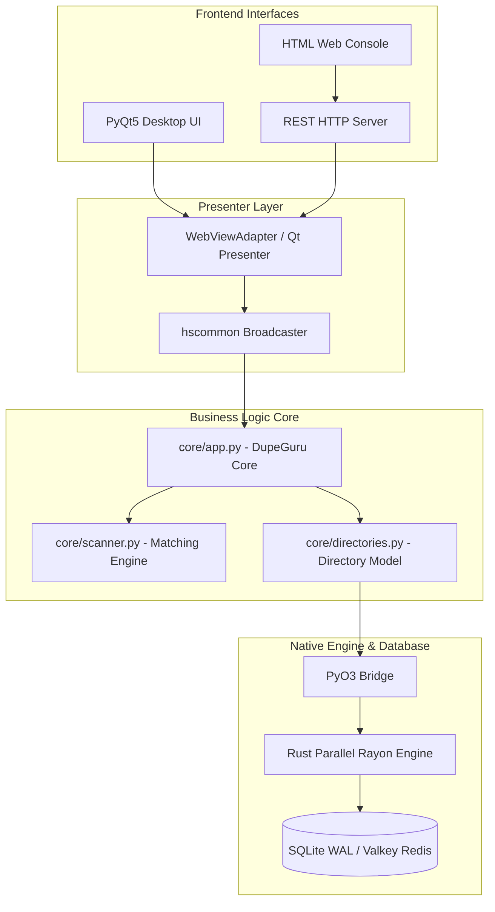

# System Architecture & Design Patterns

**de-dup** enforces a clean separation of concerns using a **Model-View-Presenter (MVP)** architectural pattern, augmented by a custom **Broadcaster** pub-sub message system and a native **Rust Engine** interface layer.

---

## Architectural Diagram

---

## Key Design Principles

1. **Double Decoupling**: Frontend UI implementations (PyQt5, Web UI, CLI) never interact directly with low-level data structures. They communicate through `hscommon.gui` presenter contracts and `Broadcaster` notifications.
2. **Native Extension Layer (PyO3)**: Heavy CPU-bound and disk-bound tasks (file crawling, checksum calculation, database persistence) delegate to compiled Rust shared libraries (`dupeguru_rust.so`).
3. **Headless Execution Compatibility**: The core application logic (`core/app.py`) can run in headless server environments without requiring X11, Wayland, or Qt display servers.
