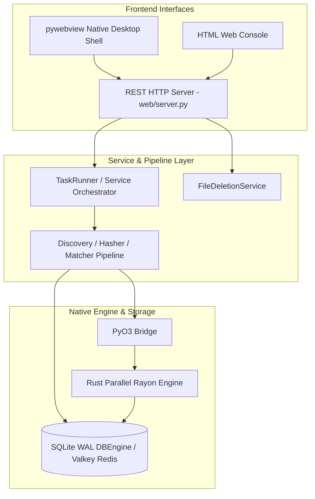

# System Architecture & Design Patterns

**de-dup** enforces a clean separation of concerns using a **Model-View-Presenter (MVP)** architectural pattern, augmented by a custom **Broadcaster** pub-sub message system and a native **Rust Engine** interface layer.

---

## Architectural Diagram

---

## Key Design Principles

1. **Decoupled Architecture**: Frontend UI implementations (`pywebview` desktop window, web browsers, CLI) never interact directly with low-level SQLite tables or C-extensions. They communicate through clean REST endpoints and service layer contracts.
2. **Native Extension Layer (PyO3)**: Heavy CPU-bound and disk-bound tasks (file crawling, checksum calculation, database persistence) delegate to compiled Rust shared libraries (`dupeguru_rust.so`).
3. **Headless & Embedded Compatibility**: The core application logic and pipelines operate independently of GUI display servers, allowing seamless execution on servers, NAS appliances, or desktop windows.
