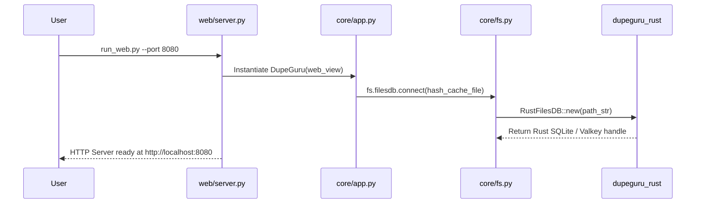
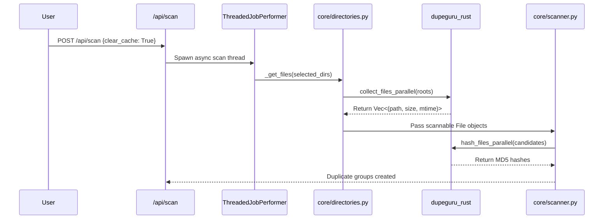

# Data Flow & Lifecycle Analysis

This document describes the runtime execution lifecycles and data flow pipelines within **de-dup**.

---

## 1. Application Boot Lifecycle

---

## 2. Scan Execution Pipeline

