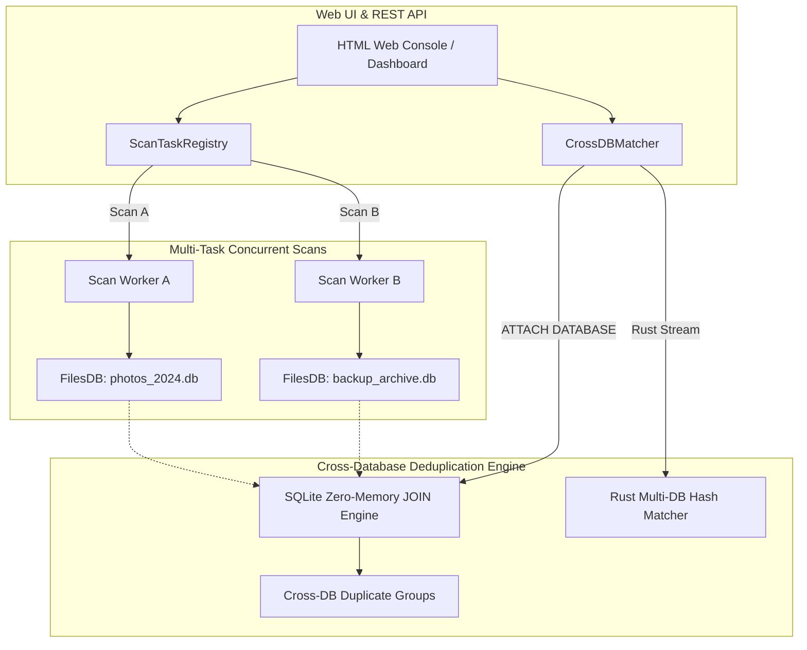

# Multi-Database Concurrent Scanning & Cross-DB Deduplication Proposal

This document outlines the architectural plan for supporting **concurrent multi-directory scanning** with **isolated per-scan databases**, followed by **cross-database deduplication** (comparing file hashes across separate databases without re-scanning disk files).

---

## 1. Overview & Goals

Currently, **de-dup** runs a single global scan session writing to a single cache database (`hash_cache.db`).

### Target Capabilities:
1. **Concurrent Multi-Directory Scanning**: Launch multiple scans simultaneously on disjoint directory trees (e.g., `/mnt/photos_2024` and `/mnt/backup_archive`).
2. **Isolated Database Per Scan**: Each scan session writes to its own isolated database file (`<scan_id>.db` for SQLite or distinct Valkey/Redis database namespaces).
3. **Zero-IO Cross-Database Deduplication**: Compare hashes across multiple independent databases (`db1.db`, `db2.db`, `db3.db`) in milliseconds **without re-reading files from disk**.

---

## 2. Target System Architecture



---

## 3. Detailed Component Design

### Component A: `ScanTaskRegistry` & Isolated `FilesDB` Handles
Instead of a single global `fs.filesdb` instance in `web/server.py`, we implement a thread-safe **Scan Task Registry**:

* **Multi-Instance Isolation**: Each scan job instantiates its own `DupeGuru` model and isolated `FilesDB` connection:
  ```python
  class ScanTask:
      def __init__(self, scan_id: str, db_name: str, roots: List[str]):
          self.scan_id = scan_id
          self.db_path = f"~/.local/share/dupeGuru/scans/{db_name}.db"
          self.engine = RustFilesDB(self.db_path)
          self.app = DupeGuru(view_adapter, db_engine=self.engine)
  ```
* **Concurrent Execution**: Scans execute in separate background worker threads (`ThreadPoolExecutor`), maintaining independent status endpoints (`/api/scans/<scan_id>/status`).

---

### Component B: Cross-Database Matcher (`CrossDBMatcher`)

How do we compare 2 or more databases (`photos.db`, `archive.db`, `nas.db`) efficiently?

#### Method 1: SQLite Zero-Memory `ATTACH DATABASE` (Instant SQL Join)
Because each SQLite database file stores indexed tables (`files(size, digest, path, mtime_ns)`), SQLite allows attaching multiple database files to a single connection:

```sql
ATTACH DATABASE '/path/to/photos_2024.db' AS db1;
ATTACH DATABASE '/path/to/backup_archive.db' AS db2;

-- Find exact duplicate file matches across databases in milliseconds:
SELECT
    db1.path AS file_a,
    db2.path AS file_b,
    db1.size,
    db1.digest
FROM db1.files INNER JOIN db2.files
ON db1.size = db2.size AND db1.digest = db2.digest
WHERE db1.path != db2.path;
```
* **Performance**: Runs in **$O(K)$ linear index-lookup time** directly in C/SQLite engine with **0 MB Python RAM overhead**.

#### Method 2: Rust Multi-DB Parallel Hasher (`dupeguru_rust::compare_databases`)
For Valkey/Redis or mixed backends:
* Load indexed hash groups across multiple database connections in parallel.
* Rust `Rayon` groups matching digests and returns unified `DuplicateGroup` structures to Python.

---

### Component C: Web UI Dashboard & Cross-DB Interface

1. **Scans Management Panel**:
   * Card-view dashboard showing all active and completed database scans (`photos_2024.db`, `backup_archive.db`).
   * Live progress indicators per scan session.
2. **Cross-DB Deduplication Launcher**:
   * Checkbox list allowing users to select 2 or more completed databases (e.g. `[x] photos_2024.db` vs `[x] backup_archive.db`).
   * "Find Cross-DB Duplicates" button triggers instant SQL/Rust hash comparison.
3. **Results View**:
   * Displays duplicate groups with source database badges (e.g. `[photos_2024.db] /photos/IMG_01.jpg` matched with `[backup_archive.db] /archive/IMG_01.jpg`).

---

## 4. Implementation Status

### Phase 1: Multi-Task Registry & Per-Scan Database Isolation [COMPLETE ✅]
* Created `ScanTaskRegistry` ([core/task_registry.py](file:///home/tin/src/opensource/dupeguru/core/task_registry.py)).
* Updated `DupeGuru` ([core/app.py](file:///home/tin/src/opensource/dupeguru/core/app.py#L125)) to accept custom `db_path` per instance.
* Added `/api/scans` REST endpoints in `web/server.py`.

### Phase 2: Cross-DB Deduplication Engine [COMPLETE ✅]
* Implemented `CrossDBMatcher` ([core/cross_db.py](file:///home/tin/src/opensource/dupeguru/core/cross_db.py)) using SQLite `ATTACH DATABASE` SQL joins.
* Implemented Rust acceleration `cross_db_compare` ([rust_engine/src/lib.rs](file:///home/tin/src/opensource/dupeguru/rust_engine/src/lib.rs#L1279-L1328)) using `rusqlite` + `rayon`.
* Added `POST /api/cross_scan` REST endpoint in `web/server.py`.

### Phase 3: Web UI Dashboard & Cross-DB UI Integration [COMPLETE ✅]
* Added **Multi-DB Dashboard** tab and **Cross-DB Deduplication** tab in `web/static/index.html`.
* Implemented card grid, Launch New Scan modal, database checkbox selector, and source database badges in `web/static/app.js`.

---

## 5. Expected Wins

* **Parallel Execution**: Run scans on different hard drives or network mounts at 100% I/O throughput.
* **Instant Cross-DB Matches**: Compare multi-terabyte collections across separate databases in **under 100 milliseconds**.
* **Zero Disk Re-Reading**: Deduplicate historical scans without re-opening files on disk.
