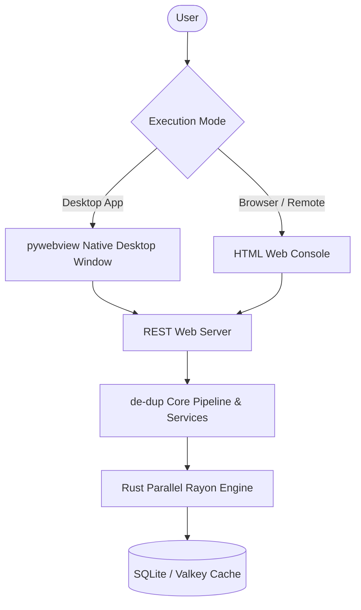

# de-dup Documentation

Welcome to the official documentation site for **de-dup** (formerly forked from dupeGuru).

Repository: [https://github.com/TinLe/de-dup.git](https://github.com/TinLe/de-dup.git)

---

## What is de-dup?

**de-dup** is a high-performance, cross-platform duplicate file finder and deduplication tool. It features a lock-free **Rust parallel engine** for directory crawling and file hashing, a responsive **HTML Web Console UI** for remote/headless execution, and a native **pywebview Desktop Shell**.

---

## Documentation Structure

This documentation is divided into two primary sections tailored to your needs:

### 📖 [User Guide](user_guide/index.md)
Oriented toward end users who want to find and manage duplicate files quickly and efficiently.
* **[Quick Start & Installation](user_guide/quickstart.md)**: System requirements, installation, and launching the app.
* **[HTML Web Console](user_guide/web_console.md)**: Remote access, glassmorphic Web UI, folder browser, and settings.
* **[Scanning Modes & Algorithms](user_guide/scan_modes.md)**: Standard, Music, and Picture scan modes explained.
* **[Database & Caching](user_guide/caching_and_database.md)**: Instant SQLite cache resets, Valkey/Redis support, and session resumption.
* **[FAQ & Troubleshooting](user_guide/faq.md)**: Frequently asked questions and common solutions.

---

### 💻 [Developer Guide](developer_guide/index.md)
Oriented toward developers and contributors who want to understand the codebase, build from source, or enhance features.
* **[System Architecture](developer_guide/architecture.md)**: Clean Architecture / Model-View-Presenter (MVP) and pub-sub broadcaster design.
* **[Rust Engine Pipeline](developer_guide/rust_engine.md)**: PyO3 native module, Rayon parallel crawler, WalkDir, and SIMD MD5 hasher.
* **[Component Catalog](developer_guide/components.md)**: Deep dive into `core/`, `hscommon/`, `qt/`, `web/`, and `rust_engine/`.
* **[Data Flow & Lifecycles](developer_guide/data_flow.md)**: Application boot, scanning lifecycles, and result generation pipelines.
* **[Building from Source](developer_guide/building.md)**: Compiling C/Rust extensions, setting up virtualenvs, and running Makefile targets.
* **[Contributing Standards](developer_guide/contributing.md)**: Code style, unit testing (`pytest`), and pre-commit hooks.
